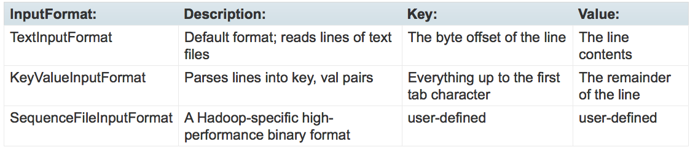

# Apache Hadoop, HDFS and Apache Pig

## Core Concepts
- Hadoop is a distributed file system
- Efficient, automatic distribution of data and work across machines
- High throughput access to information
- Data is conceptually record-oriented in the Hadoop programming framework. The Hadoop framework then schedules these processes in proximity to the location of data/records using knowledge from the distributed file system. This strategy of moving computation to the data, instead of moving the data to the computation allows Hadoop to achieve high data locality which in turn results in high performance.

- Hadoop programs must be written in the **MapReduce** model

- Flat scalability curve. Very little needs to be done to scale Hadoop to use larger amount of hardware.

## Hadoop Distributed File System (HDFS) 
### Definitions
**block**: Files may be broken into several blocks, default block size is 64MB
**NameNode**: The NameNode stores all the metadata for the file system.
**DataNode**: A machine in a cluster

### Core Concepts

- HDFS expects to store very large files
- Large block size reduces amount of metadata stored
- HDFS files are **not visible** to the Linux operating system hosting Hadoop
- data is replicated across several machines, system still works even if 1 or serveral machines fail

### Advantages
- HDFS is designed to store a very large amount of information (terabytes or petabytes). This requires spreading the data across a large number of machines. It also supports much larger file sizes than NFS.
- HDFS should store data reliably. If individual machines in the cluster malfunction, data should still be available.
- HDFS should provide fast, scalable access to this information. It should be possible to serve a larger number of clients by simply adding more machines to the cluster.
- HDFS should integrate well with Hadoop MapReduce, allowing data to be read and computed upon locally when possible.

### Disadvantages
- Applications that use HDFS are assumed to perform long sequential streaming reads from files. HDFS is optimized to provide streaming read performance; this comes at the expense of random seek times to arbitrary positions in files.
- Data will be written to the HDFS once and then read several times; updates to files after they have already been closed are not supported. (An extension to Hadoop will provide support for appending new data to the ends of files; it is scheduled to be included in Hadoop 0.19 but is not available yet.)
- Due to the large size of files, and the sequential nature of reads, the system does not provide a mechanism for local caching of data. The overhead of caching is great enough that data should simply be re-read from HDFS source.
- Individual machines are assumed to fail on a frequent basis, both permanently and intermittently. The cluster must be able to withstand the complete failure of several machines, possibly many happening at the same time (e.g., if a rack fails all together). While performance may degrade proportional to the number of machines lost, the system as a whole should not become overly slow, nor should information be lost. Data replication strategies combat this problem.

### Example cluster setup
`conf/hadoop-site.xml` - this file should be replicated across all machines
```xml
<configuration>
  <property>
    <name>fs.default.name</name>

    <value>hdfs://your.server.name.com:9000</value>
  </property>
  <property>
    <name>dfs.data.dir</name>

    <value>/home/username/hdfs/data</value>
  </property>
  <property>
    <name>dfs.name.dir</name>

    <value>/home/username/hdfs/name</value>
  </property>
</configuration>
```

### Example user commands
```shell
# Hadoop Filesystem List command  
bt> hadoop fs -ls  
Found 3 items  
drwxr-xr-x - bb8 users  0 2015-12-27 02:22 .Trash  
drwxrwxrwx - bb8 users  0 2015-11-16 19:40 random_folder  
drwxrwxrwx - bb8 users  0 2015-10-26 19:46 another_random_folder  
# Note that the above command is identical to the one below, "hadooop fs -ls" without any parameters  
# lists the content of the user's HDFS home directory  
  
bt> hadoop fs -ls /user/bb8  
Found 3 items  
drwxr-xr-x - bb8 users  0 2015-12-27 02:22 .Trash  
drwxrwxrwx - bb8 users  0 2015-11-16 19:40 random_folder  
drwxrwxrwx - bb8 users  0 2015-10-26 19:46 another_random_folder  
  
# Create a sample file in the local directory on the gateway under /homes/bb8  
bt> pwd  
/homes/bb8  
bt> echo "Hello World. My name is bb8. Hello" > sample.txt  

# Put (upload) the sample.txt file from local gateway to the HDFS  
bt> hadoop fs -put sample.txt /user/bb8  
bt> hadoop fs -ls /user/bb8  
Found 4 items  
drwxr-xr-x - bb8 users  0 2015-12-27 02:22 .Trash  
drwxrwxrwx - bb8 users  0 2015-11-16 19:40 random_folder  
drwxrwxrwx - bb8 users  0 2015-10-26 19:46 another_random_folder  
-rw-------  3 bb8 users  29 2015-12-28 04:02 sample.txt  
  
# hadoop fs -cat /user/ilambharathi/sample.txt will also give the same output, whereas on  
# compressed files (.gz, .bzip2), -text will give the uncompressed text as the output  
bt> hadoop fs -text /user/bb8/sample.txt  
Hello World. My name is bb8. Hello  
  
# Changing permissions on the file so that all can view the file.  
bt> hadoop fs -chmod 755 /user/bb8/sample.txt  
  
# Check if the file permissions are changed  
bt> hadoop fs -ls /user/bb8  
Found 4 items  
drwxr-xr-x - bb8 users  0 2015-12-27 02:22 .Trash  
drwxrwxrwx - bb8 users  0 2015-11-16 19:40 random_folder  
drwxrwxrwx - bb8 users  0 2015-10-26 19:46 another_random_folder  
-rwxr-xr-x  3 bb8 users  29 2015-12-28 04:02 sample.txt  

# Run a jar file that contains a MapReduce job
bt> hadoop <jar> <MainClass> [args]
bt> hadoop jar wc.jar WordCount /user/joe/wordcount/input /user/joe/wordcount/output
```

## MapReduce
A programming paradigm that transforms lists of input data into lists of output data, twice - *map* and *reduce*. The MapReduce model uses functional programming concepts in that data is immutable (modifying input data will not propagate back to the original data). 

note: unlike some more formal functional mapping and reducing settings, in MapReduce, an arbitrary number of values can be output from each phase; a mapper may map one input into zero, one, or one hundred outputs. A reducer may compute over an input list and emit one or a dozen different outputs.

### Map
The first phase of a MapReduce program is called mapping. A list of data elements are provided, one at a time, to a function called the Mapper, which transforms each element individually to an output data element.


### Reduce
Reducing lets you aggregate values together. A reducer function receives an iterator of input values from an input list. It then combines these values together, returning a single output value.


### Putting them together in MapReduce
**Keys and values**: In MapReduce, no value stands on its own. Every value has a key associated with it. Keys identify related values.

### Example - Word Count
High level structure:
```Python
mapper (filename, file-contents):
  for each word in file-contents:
    emit (word, 1)

reducer (word, values):
  sum = 0
  for each value in values:
    sum = sum + value
  emit (word, sum)
```


Acutal (partial) implementation:
```java
public static class MapClass extends MapReduceBase
    implements Mapper<LongWritable, Text, Text, IntWritable> {

    private final static IntWritable one = new IntWritable(1);
    private Text word = new Text();

    public void map(LongWritable key, Text value,
                    OutputCollector<Text, IntWritable> output,
                    Reporter reporter) throws IOException {
      String line = value.toString();
      StringTokenizer itr = new StringTokenizer(line);
      while (itr.hasMoreTokens()) {
        word.set(itr.nextToken());
        output.collect(word, one);
      }
    }
  }

  /**
   * A reducer class that just emits the sum of the input values.
   */
  public static class Reduce extends MapReduceBase
    implements Reducer<Text, IntWritable, Text, IntWritable> {

    public void reduce(Text key, Iterator<IntWritable> values,
                       OutputCollector<Text, IntWritable> output,
                       Reporter reporter) throws IOException {
      int sum = 0;
      while (values.hasNext()) {
        sum += values.next().get();
      }
      output.collect(key, new IntWritable(sum));
    }
  }
```

### The Driver Method
The driver initializes the job and instructs the Hadoop platform to execute your code on a set of input files, and controls where the output files are placed. 

```java
public void run(String inputPath, String outputPath) throws Exception {
    JobConf conf = new JobConf(WordCount.class);
    conf.setJobName("wordcount");

    // the keys are words (strings)
    conf.setOutputKeyClass(Text.class);
    // the values are counts (ints)
    conf.setOutputValueClass(IntWritable.class);

    conf.setMapperClass(MapClass.class);
    conf.setReducerClass(Reduce.class);

    FileInputFormat.addInputPath(conf, new Path(inputPath));
    FileOutputFormat.setOutputPath(conf, new Path(outputPath));

    JobClient.runJob(conf);
  }
```

### MapReduce Data Flow

- mapping and reducing tasks **do not** communicate with one another
- the only communication step is during the `shuffling process`

More details:


``InputFormat``: How these input files are split up and read is defined by the InputFormat. An InputFormat is a class that provides the following functionality:
- Selects the files or other objects that should be used for input
- Defines the InputSplits that break a file into tasks
- Provides a factory for RecordReader objects that read the file



``Mapper``: The map() method receives two parameters in addition to the key and the value:
- The ``OutputCollector`` object has a method named ``collect()`` which will forward a ``(key, value)`` pair to the reduce phase of the job.
- The ``Reporter`` object provides information about the current task; its getInputSplit() method will return an object describing the current InputSplit. It also allows the map task to provide additional information about its progress to the rest of the system. The setStatus() method allows you to emit a status message back to the user. The incrCounter() method allows you to increment shared performance counters. You may define as many arbitrary counters as you wish. Each mapper can increment the counters, and the JobTracker will collect the increments made by the different processes and aggregate them for later retrieval when the job ends.

``Partition & Shuffle``: This process of moving map outputs to the reducers is known as ``shuffling``. A different subset of the intermediate key space is assigned to each reduce node; these subsets (known as ``partitions``) are the inputs to the reduce tasks. Each map task may emit ``(key, value)`` pairs to any partition; **all values for the same key are always reduced together regardless of which mapper is its origin**. Therefore, the map nodes must all agree on where to send the different pieces of the intermediate data. The ``Partitioner`` class determines which partition a given (key, value) pair will go to. The default partitioner computes a hash value for the key and assigns the partition based on this result. 

``Reduce``: A Reducer instance is created for each reduce task. This is an instance of user-provided code that performs the second important phase of job-specific work. For each key in the partition assigned to a ``Reducer``, the ``Reducer``'s ``reduce()`` method is called once. This receives a key as well as an iterator over all the values associated with the key. The values associated with a key are returned by the iterator in an undefined order. The Reducer also receives as parameters ``OutputCollector`` and ``Reporter`` objects; they are used in the same manner as in the ``map()`` method.

``Output Format``:
- TextOutputFormat: Default; writes lines in "key \t value" form
- SequenceFileOutputFormat:	Writes binary files suitable for reading into subsequent MapReduce jobs
- NullOutputFormat: Disregards its inputs

### Fault Tolerance
if a `map` or `reduce` job fails, Hadoop will attempt to reexecute the job where appropriate.

### Speculative Execution
if a machine is much slower compared to the others, it might rate limit the execution speed of the entire system. Hadoop will monitor and schedule redundant jobs that have not been completed to machines that have additional resources.


## Advanced MapReduce Features

