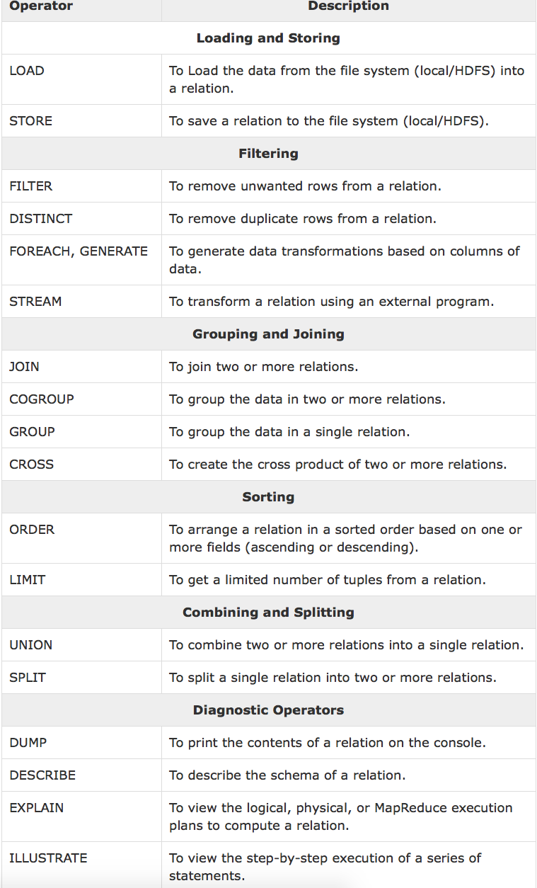
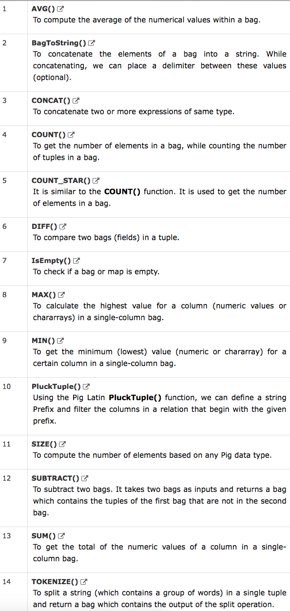

# Apache Pig References

## Data types
1. int
2. long
3. float
4. double
5. chararray
7. Boolean
8. DateTime
11. Tuple - ordered set of fields, ex. ('josh', 19)
12. Bag - ordered set of Tuples, ex. {('josh', 19), ('eric', 20)}
13. Map - a set of key-value pairs, ex.[‘name’#’Raju’, ‘age’#30]

any of the above can be **NULL**

## Relational operators


### Examples
```pig
-- loading data
students = LOAD 'test/students.txt' USING PigStorage(',') as (id:int, firstname:chararray, lastname:chararray, phone:chararray, city:chararray );

-- storing data
STORE students INTO 'output/' USING PigStorage (',');

-- group by
-- output will be {group: dataType, relation_name: {...}}
Group_data = GROUP Relation_name BY age;

-- group by multiple columns
group_multiple = GROUP student_details by (age, city);

-- cogroup
-- output will be { group: dataType, relation1_name: {...}, relation2_name: {...}, ... , relationx_name: {...} }
cogroup_data = COGROUP student_details by age, employee_details by age;


-- joins: joins relations by key, if keys don't match then drop relation
-- self-join, relation1 and relation2 are loaded from the same source
Relation3_name = JOIN Relation1_name BY key, Relation2_name BY key ;

-- inner join (similar to self join)
Relation3_name = JOIN Relation1_name BY key, Relation2_name BY key ;

-- left outer join - returns all elements in left table even if no match, and only matched items in right
Relation3_name = JOIN Relation1_name BY id LEFT OUTER, Relation2_name BY customer_id;

-- right outer join - returns all elements in right table even if no match, and only matched items in left
outer_right = JOIN customers BY id RIGHT, orders BY customer_id;

-- full outer join - return all elements in both tables even if no match
outer_full = JOIN customers BY id FULL OUTER, orders BY customer_id;

-- multiple keys join
Relation3_name = JOIN Relation2_name BY (key1, key2), Relation3_name BY (key1, key2);


-- combining and spliting
-- union
student = UNION student1, student2;

-- split
SPLIT Relation1_name INTO Relation2_name IF (condition1), Relation2_name (condition2)
-- example
SPLIT student_details into student_details1 if age<23, student_details2 if (22<age and age>25)

-- filtering
-- filter
Relation2_name = FILTER Relation1_name BY (condition);
-- exaple
filter_data = FILTER student_details BY city == 'Chennai';

-- distinct
Relation_name2 = DISTINCT Relatin_name1;

-- foreach
Relation_name2 = FOREACH Relatin_name1 GENERATE (required data);
-- example
foreach_data = FOREACH student_details GENERATE id,age,city;

-- sorting
-- order by
Relation_name2 = ORDER Relatin_name1 BY (ASC|DESC);

-- limit
Result = LIMIT Relation_name numOfRequiredTuples
```

## Eval Functions



## User Defined Functions (UDFs)
```pig
-- register UDF
REGISTER 'xxx.jar'; 

-- define alias
DEFINE alias com.xxx.Construcotr(args...);


```
