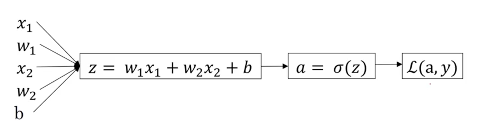

# Deep Learning Notes

## Logistic Regression
### Hypothesis
$$
a = \sigma(w^Tx + b) \\
where \ x \in R^n, w \in R^n, b \in R, \sigma(z)=\frac{1}{1+e^{-z}} \\
for\ n\ training\ examples
$$

### Loss Function
$$
L(a, y) = -(y\log a + (1-y)\log(1-a))
$$

### Cost Function
$$
J(w,b) = \frac{1}{m}\sum_{i=1}^mL(a^{(i)}, y^{(i)}) \\
= -\frac{1}{m}\sum_{i=1}^m \lbrack y^{(i)}\log a^{(i)} + (1-y^{(i)})\log(1-a^{(i)}) \rbrack \\
where\ (a^{(i)}, y^{(i)})\ refers\ to\ the\ i^{th}\ training\ example \\
for\ m\ training\ examples
$$

### Gradient Descent
$$
Repeat\ \{\ 
w := w - \alpha\frac{\partial}{\partial w}J(w, b)
\ \}
$$

## Computation Graph and Derivatives

**NEED REVISION**
$$
\frac{\partial L(a,y)}{\partial z} = \frac{\partial L(a,y)}{\partial a} \frac{\partial a}{\partial z}\\
\frac{\partial}{\partial w} L(a,y) = \frac{\partial L(a,y)}{\partial z} \frac{\partial z}{\partial w} = x \frac{\partial L(a,y)}{\partial z}\\
\frac{\partial}{\partial w} J(w,b) = \frac{1}{m} \sum^m_{i=1} \frac{\partial}{\partial w} L(a,y)
$$
Note: each (a, y) refers to a **single** (i.e. not a vector) training example and each w refers to a **single** (i.e. not a vector) parameter corrosponding to a input feature. x refers to a **single** input feature value corrosponding to w.

Assume there are m training examples and w is a vector of size n
